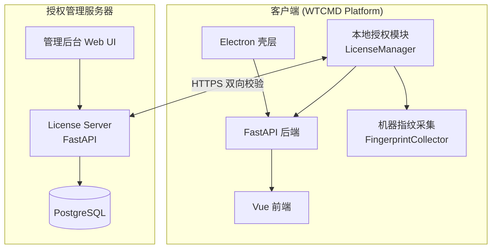
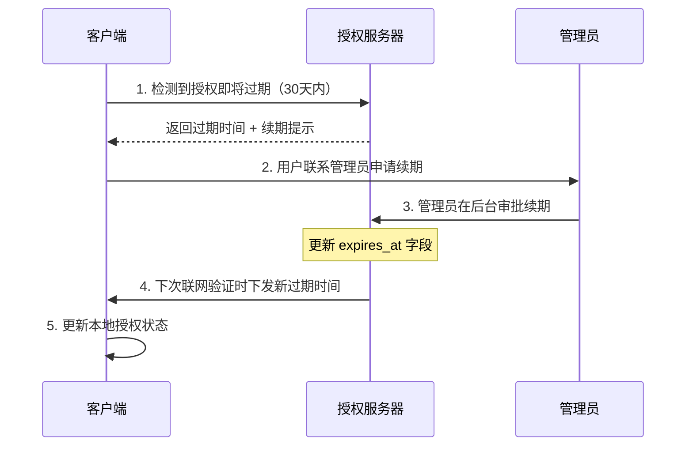

# WTCMD Platform 软件授权方案设计文档

> **版本**: v1.0  
> **日期**: 2026-06-10  
> **适用范围**: 水泥配比计算器（WTCMD Platform）桌面版 & Web 版

---

## 目录

1. [总体架构](#1-总体架构)
2. [代码不可逆（反编译保护）](#2-代码不可逆反编译保护)
3. [防破解措施](#3-防破解措施)
4. [机器指纹绑定](#4-机器指纹绑定)
5. [授权码体系](#5-授权码体系)
6. [定时联网验证](#6-定时联网验证)
7. [授权续期机制](#7-授权续期机制)
8. [授权管理服务器](#8-授权管理服务器)
9. [客户端授权模块设计](#9-客户端授权模块设计)
10. [数据库设计](#10-数据库设计)
11. [API 接口设计](#11-api-接口设计)
12. [部署与运维](#12-部署与运维)
13. [实施路线图](#13-实施路线图)

---

## 1. 总体架构

### 1.1 当前项目概况

本项目是一个前后端分离的水泥配比计算系统：

| 层级 | 技术栈 | 打包方式 |
|------|--------|----------|
| 前端 | Vue 3 + Vite + TypeScript + Element Plus | Vite 构建为静态文件 |
| 后端 | Python FastAPI + SQLite + NumPy/SciPy | PyInstaller 打包为单一 exe |
| 桌面壳 | Electron (main.cjs) | electron-builder → NSIS 安装包 |
| Web 版 | 后端直接托管前端 dist | PyInstaller + 静态资源 |

### 1.2 授权架构图



### 1.3 核心设计原则

- **代码不可逆**：打包产物经过混淆/加密，无法还原为可读源代码
- **一机一码**：授权码与机器指纹绑定，无法跨机器使用
- **时效控制**：授权码有明确的有效期，过期后核心功能锁定
- **联网校验**：客户端定期与授权服务器通信，验证授权合法性
- **离线容灾**：短期离线可用（默认 7 天宽限期），超期必须联网验证
- **服务器权威**：授权状态以服务器端记录为准，客户端不可篡改

---

## 2. 代码不可逆（反编译保护）

### 2.1 Python 后端保护

Python 的 `.pyc` 字节码容易被反编译，PyInstaller 打包后的 exe 也可被提取。因此需要多层保护：

#### 2.1.1 PyArmor 代码混淆

在 PyInstaller 打包前，使用 PyArmor 对整个后端代码进行混淆加密：

```bash
# 安装 PyArmor
pip install pyarmor

# 混淆整个 backend 目录
cd backend
pyarmor gen --recursive \
    --output dist-obfuscated \
    --platform windows.x86_64 \
    --advanced 2 \
    --restrict \
    --mix-str \
    --assert-call \
    --assert-import \
    core/ models/ routers/ services/ repositories/ database.py main.py

# 然后对混淆后的代码进行 PyInstaller 打包
pyinstaller --onefile dist-obfuscated/main.py
```

**PyArmor 保护特性**：
- 字节码加密：Python 字节码在运行时动态解密，内存中不留完整明文
- 代码混淆：重命名函数/变量名，打乱控制流
- 反调试：检测调试器附加，阻止动态分析
- 完整性校验：检测 .pyc 文件是否被篡改
- 绑定机器：可选将混淆后的代码绑定到特定机器

#### 2.1.2 PyInstaller 增强

```python
# PyInstaller .spec 配置增强
# 配合 PyArmor 使用
a = Analysis(
    ['dist-obfuscated/main.py'],
    # ... 其他配置
)

# 加密 Python 字节码（PyInstaller 内置功能）
# 在 .spec 文件中添加：
# --key=<encryption-key>
```

#### 2.1.3 Cython 编译（可选增强）

将核心计算模块（`services/regression.py`, `services/uhpc.py`）使用 Cython 编译为 `.pyd`（Windows）或 `.so`（Linux）原生扩展：

```bash
# 将关键模块编译为 C 扩展
cd backend
cythonize -i services/regression.py services/uhpc.py
```

编译后的 `.pyd` 文件极难反编译回 Python 源码。

### 2.2 前端 JavaScript 保护

#### 2.2.1 Vite 构建压缩混淆

```javascript
// frontend/vite.config.js 增强配置
import obfuscator from 'rollup-plugin-obfuscator'

export default defineConfig({
  build: {
    minify: 'terser',
    terserOptions: {
      compress: {
        drop_console: true,       // 去除 console
        drop_debugger: true,      // 去除 debugger
        pure_funcs: ['console.log']
      },
      mangle: {
        toplevel: true,           // 顶层变量名混淆
        properties: {
          regex: /^_/             // 混淆私有属性
        }
      },
      output: {
        beautify: false
      }
    },
    rollupOptions: {
      plugins: [
        // JavaScript Obfuscator 深度混淆
        obfuscator({
          compact: true,
          controlFlowFlattening: true,
          controlFlowFlatteningThreshold: 0.75,
          deadCodeInjection: true,
          deadCodeInjectionThreshold: 0.4,
          stringArray: true,
          stringArrayThreshold: 0.75,
          splitStrings: true,
          splitStringsChunkLength: 10,
          transformObjectKeys: true,
          unicodeEscapeSequence: false
        })
      ]
    }
  }
})
```

### 2.3 Electron 壳层保护

#### 2.3.1 ASAR 加密

```javascript
// desktop/package.json build 配置
{
  "build": {
    "asar": {
      "smartUnpack": false
    },
    "win": {
      "asar": true
    }
  }
}
```

#### 2.3.2 使用 electron-builder 的 afterPack 钩子进行额外加密

```javascript
// desktop/encrypt-asar.js
const { encrypt } = require('@electron/asar')
const path = require('path')

exports.default = async function(context) {
  // 打包完成后对 ASAR 进行加密
  const asarPath = path.join(context.appOutDir, 'app.asar')
  // 使用 AES 加密 ASAR 文件头
  await encrypt(asarPath, {
    algorithm: 'aes-256-cbc',
    encryptionKey: process.env.ASAR_ENCRYPT_KEY
  })
}
```

#### 2.3.3 安装包完整性签名

```javascript
// desktop/package.json
{
  "build": {
    "win": {
      "sign": "./scripts/sign-installer.js",
      "signAndEditExecutable": true,
      "certificateFile": "./cert/code-signing.pfx",
      "certificatePassword": process.env.CERT_PASSWORD
    }
  }
}
```

### 2.4 保护层级总结

| 层级 | 技术方案 | 保护效果 |
|------|----------|----------|
| Python 后端 | PyArmor 混淆 + PyInstaller 加密 | 字节码加密，反调试，防提取 |
| 核心算法 | Cython 编译为 .pyd/.so | 编译为原生代码，极难反编译 |
| 前端 JS | Terser + JS Obfuscator | 变量混淆，控制流平坦化，字符串加密 |
| Electron 壳 | ASAR 加密 + 代码签名 | 防篡改，完整性校验 |
| 安装包 | NSIS + 数字签名 | 防安装包被篡改 |

---

## 3. 防破解措施

### 3.1 多层防御体系

```
┌─────────────────────────────────────────┐
│           第一层：安装包完整性校验         │
│   数字签名验证 + 文件哈希校验             │
├─────────────────────────────────────────┤
│           第二层：运行时环境检测           │
│   虚拟机检测 + 调试器检测 + 内存篡改检测   │
├─────────────────────────────────────────┤
│           第三层：代码逻辑保护             │
│   关键逻辑分散 + 假分支 + 时间炸弹         │
├─────────────────────────────────────────┤
│           第四层：授权逻辑混淆             │
│   授权校验分散在多个模块 + 交叉验证        │
├─────────────────────────────────────────┤
│           第五层：服务器端验证             │
│   关键计算参数从服务器获取 + 行为分析      │
└─────────────────────────────────────────┘
```

### 3.2 第一层：安装包完整性校验

#### 3.2.1 启动时自校验

```python
# backend/core/integrity.py
import hashlib
import os
import sys

# 编译时嵌入的文件哈希白名单（由打包脚本生成）
EXPECTED_HASHES = {
    "backend/core/integrity.py": "sha256_hex_here",
    "backend/services/regression.py": "sha256_hex_here",
    # ... 所有模块的哈希
}

def verify_integrity() -> bool:
    """启动时校验所有核心模块的文件哈希"""
    base_path = os.path.dirname(sys.executable) if getattr(sys, "frozen", False) \
                else os.path.dirname(__file__)
    
    for rel_path, expected_hash in EXPECTED_HASHES.items():
        file_path = os.path.join(base_path, rel_path)
        if not os.path.exists(file_path):
            return False
        
        with open(file_path, "rb") as f:
            actual_hash = hashlib.sha256(f.read()).hexdigest()
        
        if not hmac.compare_digest(actual_hash, expected_hash):
            # 使用恒定时间比较防止时序攻击
            return False
    
    return True
```

### 3.3 第二层：运行时环境检测

```python
# backend/core/anti_tamper.py
import platform
import sys
import os

class RuntimeGuard:
    """运行时环境保护"""
    
    @staticmethod
    def detect_vm() -> bool:
        """检测是否在虚拟机中运行"""
        vm_indicators = []
        
        # 1. 检测常见虚拟化硬件
        if platform.system() == "Windows":
            import subprocess
            try:
                result = subprocess.run(
                    ["wmic", "computersystem", "get", "manufacturer,model"],
                    capture_output=True, text=True, timeout=5
                )
                output = result.stdout.lower()
                vm_keywords = ["virtualbox", "vmware", "qemu", "kvm", 
                              "hyper-v", "parallels", "xen"]
                for keyword in vm_keywords:
                    if keyword in output:
                        vm_indicators.append(f"VM detected: {keyword}")
            except Exception:
                pass
        
        # 2. 检测典型 VM 文件/驱动
        vm_files = [
            "C:\\Windows\\System32\\drivers\\VBoxMouse.sys",
            "C:\\Windows\\System32\\drivers\\VBoxGuest.sys",
            "C:\\Windows\\System32\\drivers\\vmci.sys",
            "C:\\Windows\\System32\\drivers\\vmmemctl.sys",
        ]
        for f in vm_files:
            if os.path.exists(f):
                vm_indicators.append(f"VM driver found: {f}")
        
        # 3. 检测低内存/低CPU核心数（典型沙箱特征）
        import psutil
        if psutil.virtual_memory().total < 2 * 1024**3:  # < 2GB
            vm_indicators.append("Low memory (sandbox)")
        
        return len(vm_indicators) > 2  # 多个指标同时满足才判定为 VM
    
    @staticmethod
    def detect_debugger() -> bool:
        """检测是否被调试"""
        indicators = []
        
        # 1. 检测常见调试器进程
        debugger_processes = [
            "x64dbg.exe", "x32dbg.exe", "ollydbg.exe",
            "ida.exe", "ida64.exe", "windbg.exe",
            "dnspy.exe", "ilspy.exe", "cheatengine-x86_64.exe",
            "ProcessHacker.exe", "procmon.exe", "procmon64.exe"
        ]
        
        try:
            import psutil
            running = {p.name().lower() for p in psutil.process_iter(['name'])}
            for dbg in debugger_processes:
                if dbg.lower() in running:
                    indicators.append(f"Debugger running: {dbg}")
        except Exception:
            pass
        
        # 2. PyArmor 内置反调试（如果使用 PyArmor）
        # 由 PyArmor 运行时自动处理
        
        return len(indicators) > 0
    
    @staticmethod
    def check_time_integrity() -> bool:
        """检测系统时间是否被回拨"""
        # 1. 检查系统时间是否晚于上次记录的时间
        # 2. 对比多个时间源（系统时间 vs NTP 时间）
        # 3. 检查关键文件时间戳
        pass
```

### 3.4 第三层：代码逻辑保护

#### 3.4.1 关键逻辑分散

将授权校验的核心判断分散到多个不相关的模块中，而非集中在一个函数：

```python
# 示例：分散授权校验

# 在 regression.py 中嵌入校验片段
def _license_check_part1(params):
    """隐藏在回归计算中的授权校验片段"""
    if not hasattr(params, '_license_token_1'):
        raise ValueError("Invalid calculation parameters")  # 实际是授权失败
    return True

# 在 uhpc.py 中嵌入校验片段
def _license_check_part2(design_params):
    """隐藏在 UHPC 设计中的授权校验片段"""
    if design_params.get('_auth_salt') != get_expected_salt():
        return np.nan  # 返回 NaN 让计算失败
    return True
```

#### 3.4.2 假分支和蜜罐

在代码中放置看起来像授权校验逻辑但实际上永远不会触发的"蜜罐"代码，引诱破解者浪费时间。

### 3.5 第四层：授权逻辑混淆

```python
# backend/core/license_validator.py（防篡改设计）

import hashlib
import hmac
import json
import time
from cryptography.fernet import Fernet
from cryptography.hazmat.primitives import hashes
from cryptography.hazmat.primitives.kdf.pbkdf2 import PBKDF2HMAC
import base64

class LicenseValidator:
    """
    授权校验器 - 核心设计：
    1. 授权信息加密存储，密钥从多个来源派生（防止单点密钥泄露）
    2. 关键判断逻辑使用 HMAC 签名防止修改
    3. 授权状态多处冗余存储，交叉校验
    """
    
    def __init__(self):
        self._storage_path = self._get_storage_path()
        # 密钥派生自多源：机器指纹 + 硬编码盐 + 动态因子
        self._cipher = self._derive_cipher()
    
    def _derive_cipher(self):
        """从多个来源派生加密密钥，防止密钥被提取"""
        # 来源1：部分机器指纹
        fp_part = self._get_machine_fingerprint()[:32]
        # 来源2：编译时嵌入的盐（分散存储）
        salt_parts = self._collect_salt_parts()
        # 来源3：文件系统特征
        fs_salt = self._get_fs_characteristics()
        
        combined = f"{fp_part}{''.join(salt_parts)}{fs_salt}".encode()
        
        kdf = PBKDF2HMAC(
            algorithm=hashes.SHA256(),
            length=32,
            salt=b'wtcmd_license_kdf_2026',
            iterations=480_000,
        )
        key = base64.urlsafe_b64encode(kdf.derive(combined))
        return Fernet(key)
    
    def _collect_salt_parts(self) -> list:
        """从代码的多个分散位置收集盐片段"""
        parts = []
        # 这些片段以字符串形式分散嵌入在不同模块的无关函数中
        # 破解者必须找到所有片段才能组装完整密钥
        from core._secrets import SALT_PART_1  # 分散在 core 模块
        from services._secrets import SALT_PART_2  # 分散在 services 模块
        from routers._secrets import SALT_PART_3  # 分散在 routers 模块
        parts.extend([SALT_PART_1, SALT_PART_2, SALT_PART_3])
        return parts
    
    def validate_license(self, license_key: str, fingerprint: str) -> dict:
        """验证授权码（结果会多处冗余存储，启动时交叉校验）"""
        # 解密授权码
        try:
            license_data = self._decrypt_license(license_key)
        except Exception:
            return {"valid": False, "reason": "invalid_format"}
        
        # 验证机器指纹绑定
        if not hmac.compare_digest(license_data.get("fingerprint", ""), fingerprint):
            return {"valid": False, "reason": "fingerprint_mismatch"}
        
        # 验证有效期
        expires_at = license_data.get("expires_at", 0)
        if time.time() > expires_at:
            return {"valid": False, "reason": "expired"}
        
        # 写入本地缓存 + 注册表（Windows）/ plist（macOS）
        self._save_license_state(license_data)
        self._save_registry_backup(license_data)  # 冗余备份到注册表
        
        return {"valid": True, "expires_at": expires_at, "features": license_data.get("features", [])}
```

### 3.6 第五层：服务器端验证

- 关键计算参数（如回归系数、材料默认值）的一部分从授权服务器动态获取
- 客户端行为模式分析：异常操作频率检测
- 服务器日志对比：同一授权的并发使用检测

---

## 4. 机器指纹绑定

### 4.1 指纹采集方案

```python
# backend/core/fingerprint.py
import hashlib
import platform
import uuid
import subprocess
import os
import sys

class FingerprintCollector:
    """
    机器指纹采集器
    
    采集多个硬件标识符，组合成唯一指纹。
    设计原则：
    - 硬件更换容错：允许部分标识变化（如更换网卡），使用模糊匹配
    - 隐私保护：只取哈希，不上传原始硬件信息
    - 稳定性：优先使用不随系统重装变化的标识
    """
    
    @staticmethod
    def collect() -> str:
        """采集机器指纹并返回 SHA-256 哈希"""
        components = []
        
        # 1. CPU 序列号（最稳定）
        cpu_id = FingerprintCollector._get_cpu_id()
        if cpu_id:
            components.append(f"cpu:{cpu_id}")
        
        # 2. 主板序列号（稳定）
        board_id = FingerprintCollector._get_motherboard_serial()
        if board_id:
            components.append(f"board:{board_id}")
        
        # 3. 系统磁盘序列号（稳定）
        disk_id = FingerprintCollector._get_system_disk_serial()
        if disk_id:
            components.append(f"disk:{disk_id}")
        
        # 4. MAC 地址（可能变化）
        mac = FingerprintCollector._get_primary_mac()
        if mac:
            components.append(f"mac:{mac}")
        
        # 5. 机器 GUID（Windows）/ machine-id（Linux）
        machine_guid = FingerprintCollector._get_machine_guid()
        if machine_guid:
            components.append(f"guid:{machine_guid}")
        
        # 6. 操作系统版本 + 主机名（辅助）
        components.append(f"os:{platform.platform()}")
        components.append(f"hostname:{platform.node()}")
        
        raw = "|".join(components)
        return hashlib.sha256(raw.encode()).hexdigest()
    
    @staticmethod
    def collect_components() -> dict:
        """采集各组件原始值（仅用于激活时上传到服务器）"""
        return {
            "cpu_id": FingerprintCollector._get_cpu_id(),
            "motherboard_serial": FingerprintCollector._get_motherboard_serial(),
            "system_disk_serial": FingerprintCollector._get_system_disk_serial(),
            "mac_address": FingerprintCollector._get_primary_mac(),
            "machine_guid": FingerprintCollector._get_machine_guid(),
            "os_platform": platform.platform(),
            "hostname": platform.node(),
        }
    
    @staticmethod
    def _get_cpu_id() -> str:
        """获取 CPU 序列号"""
        if platform.system() == "Windows":
            try:
                result = subprocess.run(
                    ["wmic", "cpu", "get", "ProcessorId"],
                    capture_output=True, text=True, timeout=5
                )
                lines = [l.strip() for l in result.stdout.splitlines() if l.strip()]
                if len(lines) > 1:
                    return lines[1]
            except Exception:
                pass
        elif platform.system() == "Linux":
            try:
                with open("/proc/cpuinfo") as f:
                    for line in f:
                        if "Serial" in line:
                            return line.split(":")[1].strip()
            except Exception:
                pass
        return ""
    
    @staticmethod
    def _get_motherboard_serial() -> str:
        """获取主板序列号"""
        if platform.system() == "Windows":
            try:
                result = subprocess.run(
                    ["wmic", "baseboard", "get", "SerialNumber"],
                    capture_output=True, text=True, timeout=5
                )
                lines = [l.strip() for l in result.stdout.splitlines() if l.strip()]
                if len(lines) > 1:
                    return lines[1]
            except Exception:
                pass
        elif platform.system() == "Linux":
            try:
                result = subprocess.run(
                    ["dmidecode", "-s", "baseboard-serial-number"],
                    capture_output=True, text=True, timeout=5
                )
                return result.stdout.strip()
            except Exception:
                pass
        return ""
    
    @staticmethod
    def _get_system_disk_serial() -> str:
        """获取系统盘序列号"""
        if platform.system() == "Windows":
            try:
                result = subprocess.run(
                    ["wmic", "diskdrive", "where", "Index=0", "get", "SerialNumber"],
                    capture_output=True, text=True, timeout=5
                )
                lines = [l.strip() for l in result.stdout.splitlines() if l.strip()]
                if len(lines) > 1:
                    return lines[1].strip()
            except Exception:
                pass
        return ""
    
    @staticmethod
    def _get_primary_mac() -> str:
        """获取主网卡 MAC 地址"""
        try:
            mac = uuid.getnode()
            return ':'.join(f"{(mac >> i) & 0xff:02x}" for i in range(40, -8, -8))
        except Exception:
            return ""
    
    @staticmethod
    def _get_machine_guid() -> str:
        """获取机器 GUID"""
        if platform.system() == "Windows":
            try:
                result = subprocess.run(
                    ['reg', 'query', 
                     'HKEY_LOCAL_MACHINE\\SOFTWARE\\Microsoft\\Cryptography',
                     '/v', 'MachineGuid'],
                    capture_output=True, text=True, timeout=5
                )
                for line in result.stdout.splitlines():
                    if "MachineGuid" in line:
                        return line.split()[-1].strip()
            except Exception:
                pass
        elif platform.system() == "Linux":
            try:
                with open("/etc/machine-id") as f:
                    return f.read().strip()
            except Exception:
                pass
        return ""
```

### 4.2 指纹容错机制

当用户更换部分硬件（如网卡、硬盘）时，不应立即判定为无效授权：

```python
# backend/core/fingerprint.py (继续)

def compute_similarity(fp1: str, fp2: str) -> float:
    """
    计算两个指纹的相似度（0-1）
    用于硬件变更容错
    """
    # 分解为各组件哈希
    try:
        components1 = {k: v for k, v in [c.split(":") for c in fp1.split("|") if ":" in c]}
        components2 = {k: v for k, v in [c.split(":") for c in fp2.split("|") if ":" in c]}
    except Exception:
        return 0.0
    
    matched = 0
    total = 0
    
    # 加权匹配：CPU 和主板权重最高
    weights = {
        "cpu": 3.0,
        "board": 3.0,
        "disk": 2.0,
        "guid": 2.0,
        "mac": 1.0,
        "os": 0.5,
        "hostname": 0.0,  # 忽略主机名
    }
    
    for component in ["cpu", "board", "disk", "guid", "mac"]:
        w = weights.get(component, 1.0)
        total += w
        if components1.get(component) == components2.get(component):
            matched += w
    
    return matched / total if total > 0 else 0.0


# 容错阈值：相似度 >= 0.7 视为同一台机器
FINGERPRINT_SIMILARITY_THRESHOLD = 0.7
```

---

## 5. 授权码体系

### 5.1 授权码格式

```
WTCMD-XXXXX-XXXXX-XXXXX-XXXXX-XXXXX
```

共 25 位字符（含连字符），由以下信息加密编码而成：

| 字段 | 长度 | 说明 |
|------|------|------|
| 版本号 | 1 字节 | 授权码格式版本 |
| 产品 ID | 2 字节 | 产品标识（标准版/专业版） |
| 机器指纹哈希 | 8 字节 | 绑定机器指纹的前 8 字节 |
| 授权类型 | 1 字节 | 0=试用 1=正式 2=企业 |
| 激活时间 | 4 字节 | Unix timestamp 低 32 位 |
| 过期时间 | 4 字节 | Unix timestamp 低 32 位 |
| 功能掩码 | 2 字节 | 功能开关位图 |
| 保留字段 | 2 字节 | 扩展预留 |
| CRC 校验 | 2 字节 | CRC-16 校验和 |

### 5.2 授权码生成流程

```python
# 授权服务器端：license_server/generator.py
import struct
import hashlib
import base64
from datetime import datetime, timedelta
from cryptography.hazmat.primitives.ciphers import Cipher, algorithms, modes
from cryptography.hazmat.primitives import padding
import os

class LicenseGenerator:
    """
    授权码生成器（仅在授权服务器上运行）
    """
    
    LICENSE_VERSION = 1
    PRODUCT_STANDARD = 0x01   # 标准版
    PRODUCT_PROFESSIONAL = 0x02  # 专业版
    LICENSE_TRIAL = 0x00
    LICENSE_FORMAL = 0x01
    LICENSE_ENTERPRISE = 0x02
    
    def __init__(self, master_key: bytes):
        """
        master_key: 32 字节主密钥，由授权服务器管理员保管
        """
        self._master_key = master_key
    
    def generate(self, 
                 product_id: int,
                 fingerprint_hash: str,
                 license_type: int,
                 duration_days: int,
                 features: int) -> str:
        """
        生成授权码
        
        Args:
            product_id: 产品 ID
            fingerprint_hash: 客户端机器指纹的 SHA-256 哈希
            license_type: 授权类型（试用/正式/企业）
            duration_days: 有效天数
            features: 功能掩码
        
        Returns:
            格式化的授权码字符串
        """
        now = int(datetime.utcnow().timestamp())
        expires = now + duration_days * 86400
        
        # 指纹取前 8 字节
        fp_bytes = bytes.fromhex(fingerprint_hash)[:8]
        
        # 构建载荷
        payload = struct.pack(
            ">BHB8sBIIH2s",
            self.LICENSE_VERSION,   # 1 字节
            product_id,             # 2 字节
            self.LICENSE_VERSION,   # 1 字节 (reserved)
            fp_bytes,               # 8 字节
            license_type,           # 1 字节
            now & 0xFFFFFFFF,       # 4 字节
            expires & 0xFFFFFFFF,   # 4 字节
            features & 0xFFFF,      # 2 字节
            b'\x00' * 2             # 2 字节保留
        )
        
        # 计算 CRC-16
        crc = self._crc16(payload)
        payload += struct.pack(">H", crc)
        
        # AES-256-CBC 加密
        iv = os.urandom(16)
        cipher = Cipher(algorithms.AES(self._master_key), modes.CBC(iv))
        encryptor = cipher.encryptor()
        
        padder = padding.PKCS7(128).padder()
        padded = padder.update(payload) + padder.finalize()
        
        encrypted = encryptor.update(padded) + encryptor.finalize()
        combined = iv + encrypted
        
        # Base32 编码并格式化
        encoded = base64.b32hex_encode(combined).decode('ascii')
        return self._format_key(encoded)
    
    def _crc16(self, data: bytes) -> int:
        """CRC-16-CCITT"""
        crc = 0xFFFF
        for byte in data:
            crc ^= byte << 8
            for _ in range(8):
                if crc & 0x8000:
                    crc = (crc << 1) ^ 0x1021
                else:
                    crc <<= 1
                crc &= 0xFFFF
        return crc
    
    def _format_key(self, raw: str) -> str:
        """格式化为 WTCMD-XXXXX-XXXXX-XXXXX-XXXXX-XXXXX"""
        # 取前 25 个字符（Base32 编码后通常 32+ 字符）
        raw = raw[:25].upper()
        groups = [raw[i:i+5] for i in range(0, 25, 5)]
        return "WTCMD-" + "-".join(groups)
```

### 5.3 授权类型

| 类型 | 有效期 | 功能 | 使用场景 |
|------|--------|------|----------|
| 试用授权 | 30 天 | 全功能 | 新用户体验 |
| 正式授权 | 365 天 | 全功能 | 正式购买用户 |
| 企业授权 | 365 天 × N | 全功能 + API 接口 | 批量采购 |

### 5.4 前端授权激活界面

在现有登录页之前增加授权激活页面：

```typescript
// frontend/src/views/LicenseActivateView.vue 的流程设计
// 
// 1. 首次启动 → 显示"软件未激活"提示
// 2. 输入授权码 (WTCMD-XXXXX-XXXXX-XXXXX-XXXXX-XXXXX)
// 3. 自动采集机器指纹上传到授权服务器
// 4. 服务器验证授权码 + 指纹匹配
// 5. 激活成功 → 写入本地授权文件 → 进入登录页
// 6. 激活失败 → 显示具体原因（过期/指纹不匹配/无效等）
```

---

## 6. 定时联网验证

### 6.1 验证策略

```
┌──────────────────────────────────────────────────────────┐
│                    授权验证状态机                          │
├──────────────────────────────────────────────────────────┤
│                                                           │
│   ┌──────────┐    成功     ┌──────────────┐              │
│   │  未激活   │ ─────────→ │   已激活有效   │              │
│   └──────────┘            └──────┬───────┘              │
│                                  │                        │
│                    ┌─────────────┼─────────────┐         │
│                    │             │             │         │
│              每7天自动     手动检查     服务器撤销       │
│              联网验证      授权状态     授权            │
│                    │             │             │         │
│                    ▼             ▼             ▼         │
│              ┌──────────┐ ┌──────────┐ ┌──────────┐     │
│              │ 验证通过  │ │ 授权过期  │ │ 授权吊销  │     │
│              │ (续期7天) │ │ (锁定)   │ │ (锁定)   │     │
│              └──────────┘ └──────────┘ └──────────┘     │
│                                                           │
└──────────────────────────────────────────────────────────┘
```

### 6.2 验证周期

| 阶段 | 频率 | 行为 |
|------|------|------|
| 正常使用 | 每 7 天 | 后台静默联网验证 |
| 离线宽限 | 7 天到 14 天 | 每次启动提醒"即将需要联网验证" |
| 离线超期 | 超过 14 天未验证 | 功能锁定，必须联网验证后才恢复 |
| 主动检查 | 每次启动时 | 检查本地授权状态，决定是否需要联网 |

### 6.3 客户端验证实现

```python
# backend/core/license_manager.py

import time
import json
import os
import hashlib
import hmac
import requests
from cryptography.fernet import Fernet
from datetime import datetime, timedelta

class LicenseManager:
    """客户端授权管理器"""
    
    # 配置常量
    LICENSE_SERVER_URL = "https://license.wtcmd.com/api"  # 生产环境
    VERIFY_INTERVAL_DAYS = 7        # 正常验证间隔
    GRACE_PERIOD_DAYS = 14          # 最大离线宽限期
    LOCAL_LICENSE_FILE = "license.dat"  # 本地授权文件
    LICENSE_STATE_FILE = "license_state.json"  # 本地状态文件
    
    def __init__(self, cipher: Fernet):
        self._cipher = cipher
    
    def check_license_on_startup(self) -> dict:
        """
        启动时检查授权状态
        返回 {"status": "active|expired|grace|locked", ...}
        """
        state = self._load_local_state()
        
        if not state:
            return {"status": "not_activated"}
        
        # 检查是否需要联网验证
        last_verified = state.get("last_verified_at", 0)
        days_since_verify = (time.time() - last_verified) / 86400
        
        if days_since_verify < self.VERIFY_INTERVAL_DAYS:
            # 在验证间隔内，使用本地状态
            if time.time() > state.get("expires_at", 0):
                return {"status": "expired"}
            return {"status": "active", "days_until_verify": 
                    self.VERIFY_INTERVAL_DAYS - days_since_verify}
        
        elif days_since_verify < self.GRACE_PERIOD_DAYS:
            # 宽限期内，允许使用但需要联网
            if time.time() > state.get("expires_at", 0):
                return {"status": "expired"}
            
            # 尝试后台联网验证
            result = self._try_online_verify(state.get("license_key"))
            if result["success"]:
                self._update_verified_state(result)
                return {"status": "active"}
            else:
                return {
                    "status": "grace",
                    "grace_days_remaining": self.GRACE_PERIOD_DAYS - days_since_verify,
                    "message": "请尽快连接网络以验证授权"
                }
        
        else:
            # 超过宽限期，必须联网验证
            result = self._try_online_verify(state.get("license_key"))
            if result["success"]:
                self._update_verified_state(result)
                return {"status": "active"}
            else:
                return {"status": "locked", "message": "授权验证失败，请连接网络后重试"}
    
    def activate_license(self, license_key: str) -> dict:
        """激活授权"""
        from core.fingerprint import FingerprintCollector
        
        fingerprint = FingerprintCollector.collect()
        components = FingerprintCollector.collect_components()
        
        # 向授权服务器提交激活请求
        response = self._call_license_server("/activate", {
            "license_key": license_key,
            "fingerprint": fingerprint,
            "fingerprint_components": components,
            "client_version": "1.0.0",
            "platform": self._get_platform_info(),
        })
        
        if response.get("success"):
            # 保存授权信息到本地
            self._save_license_state(response["data"])
            return {"success": True}
        else:
            return {"success": False, "error": response.get("error", "激活失败")}
    
    def _try_online_verify(self, license_key: str) -> dict:
        """尝试联网验证授权"""
        try:
            from core.fingerprint import FingerprintCollector
            fingerprint = FingerprintCollector.collect()
            
            response = self._call_license_server("/verify", {
                "license_key": license_key,
                "fingerprint": fingerprint,
                "timestamp": int(time.time()),
            }, timeout=10)
            
            return response
        except requests.RequestException:
            return {"success": False, "error": "network_unavailable"}
    
    def _call_license_server(self, endpoint: str, data: dict, timeout: int = 15) -> dict:
        """调用授权服务器 API"""
        url = f"{self.LICENSE_SERVER_URL}{endpoint}"
        
        # 请求签名（防重放攻击）
        nonce = os.urandom(16).hex()
        timestamp = str(int(time.time()))
        signature = self._sign_request(data, nonce, timestamp)
        
        headers = {
            "X-Client-Nonce": nonce,
            "X-Client-Timestamp": timestamp,
            "X-Client-Signature": signature,
            "Content-Type": "application/json",
        }
        
        response = requests.post(url, json=data, headers=headers, timeout=timeout)
        response.raise_for_status()
        return response.json()
    
    def _sign_request(self, data: dict, nonce: str, timestamp: str) -> str:
        """对请求进行签名"""
        # 使用客户端与服务器共享的密钥进行 HMAC 签名
        raw = f"{json.dumps(data, sort_keys=True)}|{nonce}|{timestamp}"
        return hmac.new(
            self._get_client_secret(),
            raw.encode(),
            hashlib.sha256
        ).hexdigest()
    
    def _save_license_state(self, data: dict):
        """加密保存授权状态到本地文件"""
        license_file = self._get_license_file_path()
        encrypted = self._cipher.encrypt(json.dumps(data).encode())
        with open(license_file, "wb") as f:
            f.write(encrypted)
        
        # 防篡改：冗余保存到注册表/系统配置目录
        self._save_registry_backup(data)
    
    def _load_local_state(self) -> dict | None:
        """从本地加密文件读取授权状态"""
        license_file = self._get_license_file_path()
        if not os.path.exists(license_file):
            return None
        
        try:
            with open(license_file, "rb") as f:
                encrypted = f.read()
            decrypted = self._cipher.decrypt(encrypted)
            return json.loads(decrypted)
        except Exception:
            return None
    
    def _save_registry_backup(self, data: dict):
        """在系统注册表（Windows）或配置目录（Linux）中做冗余备份"""
        if os.name == "nt":
            import winreg
            try:
                key = winreg.CreateKey(winreg.HKEY_CURRENT_USER, 
                    r"Software\WTCMD\License")
                winreg.SetValueEx(key, "State", 0, winreg.REG_BINARY,
                    self._cipher.encrypt(json.dumps(data).encode()))
                winreg.CloseKey(key)
            except Exception:
                pass
        else:
            # Linux: 保存在 ~/.config/wtcmd/
            config_dir = os.path.expanduser("~/.config/wtcmd")
            os.makedirs(config_dir, exist_ok=True)
            backup_path = os.path.join(config_dir, "license.backup")
            with open(backup_path, "wb") as f:
                f.write(self._cipher.encrypt(json.dumps(data).encode()))
    
    def _get_license_file_path(self) -> str:
        """获取授权文件路径"""
        if getattr(sys, "frozen", False):
            base = os.path.dirname(sys.executable)
        else:
            base = os.path.dirname(os.path.dirname(__file__))
        return os.path.join(base, "license.dat")
    
    def _get_client_secret(self) -> bytes:
        """获取客户端密钥（编译时嵌入，PyArmor 保护）"""
        # 此密钥在编译时由打包脚本生成并嵌入
        # 与授权服务器共享同一密钥
        return b'__WTCMD_CLIENT_SECRET_PLACEHOLDER__'
```

### 6.4 前端定时验证提示

在 Electron 桌面版的 `main.cjs` 和前端 Vue 应用中增加授权状态检查：

```javascript
// desktop/main.cjs 中增加授权状态检查
// 在 startBackend() 后、createWindow() 前调用

async function checkLicenseStatus() {
  const url = `${startUrl()}/api/license/status`
  try {
    const response = await fetch(url)
    const data = await response.json()
    
    if (data.status === 'not_activated') {
      // 重定向到激活页面
      mainWindow.loadURL(`${startUrl()}/#/activate`)
    } else if (data.status === 'locked') {
      // 显示锁定提示
      dialog.showErrorBox('授权已锁定', '请连接网络后重新验证授权')
      app.quit()
    } else if (data.status === 'grace') {
      // 显示提醒
      dialog.showMessageBox({
        type: 'warning',
        title: '授权即将过期',
        message: `请在 ${data.grace_days_remaining} 天内连接网络验证授权`,
        buttons: ['知道了']
      })
    }
  } catch (error) {
    // 网络不可用时的处理
  }
}
```

---

## 7. 授权续期机制

### 7.1 续期流程



### 7.2 客户端续期检测

```python
# backend/core/license_manager.py (续期部分)

def check_renewal_needed(self) -> dict:
    """检查是否需要续期"""
    state = self._load_local_state()
    if not state:
        return {"renewal_needed": False}
    
    expires_at = state.get("expires_at", 0)
    days_remaining = (expires_at - time.time()) / 86400
    
    if days_remaining <= 0:
        return {
            "renewal_needed": True,
            "status": "expired",
            "message": "授权已过期，请重新申请授权或续期"
        }
    elif days_remaining <= 30:
        return {
            "renewal_needed": True,
            "status": "expiring_soon",
            "days_remaining": int(days_remaining),
            "message": f"授权将在 {int(days_remaining)} 天后过期，建议联系管理员续期"
        }
    else:
        return {
            "renewal_needed": False,
            "days_remaining": int(days_remaining)
        }

def renew_license(self) -> dict:
    """尝试续期授权"""
    state = self._load_local_state()
    if not state:
        return {"success": False, "error": "无有效授权信息"}
    
    result = self._call_license_server("/renew", {
        "license_key": state["license_key"],
        "fingerprint_hash": state.get("fingerprint_hash"),
    })
    
    if result.get("success"):
        self._save_license_state(result["data"])
        return {"success": True, "new_expires_at": result["data"]["expires_at"]}
    else:
        return {"success": False, "error": result.get("error", "续期失败")}
```

### 7.3 续期策略

| 续期类型 | 时长 | 条件 | 费用 |
|----------|------|------|------|
| 自动续期 | +365 天 | 有效期内申请 | 按年费 |
| 过期续期 | +365 天 | 过期 30 天内 | 按年费 + 延迟费 |
| 重新激活 | +365 天 | 过期超过 30 天 | 按新购计算 |

---

## 8. 授权管理服务器

### 8.1 技术选型

| 组件 | 技术 | 说明 |
|------|------|------|
| Web 框架 | FastAPI | 与客户端后端技术栈一致 |
| 数据库 | PostgreSQL | 支持事务、JSON 字段 |
| 缓存 | Redis | 高频验证缓存、限流 |
| 管理后台 | Vue 3 + Element Plus | 复用前端技术栈 |
| 部署 | Docker + Nginx | 容器化部署 |

### 8.2 服务器目录结构

```
license-server/
├── app/
│   ├── __init__.py
│   ├── main.py                  # FastAPI 应用入口
│   ├── config.py                # 配置管理
│   ├── database.py              # 数据库连接和初始化
│   ├── models/
│   │   ├── __init__.py
│   │   └── schemas.py           # Pydantic 模型
│   ├── routers/
│   │   ├── __init__.py
│   │   ├── activate.py          # 激活接口
│   │   ├── verify.py            # 验证接口
│   │   ├── renew.py             # 续期接口
│   │   ├── revoke.py            # 吊销接口
│   │   ├── admin.py             # 管理后台接口
│   │   └── auth.py              # 管理后台认证
│   ├── services/
│   │   ├── __init__.py
│   │   ├── license_service.py   # 授权核心业务
│   │   ├── key_service.py       # 密钥管理
│   │   └── analytics_service.py # 统计与分析
│   ├── utils/
│   │   ├── __init__.py
│   │   ├── crypto.py            # 加密工具
│   │   └── rate_limit.py        # 限流工具
│   └── admin-frontend/          # 管理后台前端（Vue 3）
│       ├── src/
│       └── package.json
├── docker-compose.yml
├── Dockerfile
├── requirements.txt
├── alembic/                     # 数据库迁移
└── tests/
```

### 8.3 核心功能模块

#### 8.3.1 客户端激活

```python
# license-server/app/services/license_service.py

class LicenseService:
    """授权业务核心服务"""
    
    def __init__(self, db: AsyncSession, redis: Redis):
        self.db = db
        self.redis = redis
    
    async def activate(self, 
                       license_key: str,
                       fingerprint: str,
                       fingerprint_components: dict,
                       client_info: dict) -> ActivateResult:
        """
        处理客户端激活请求
        
        步骤：
        1. 解密并验证授权码
        2. 检查授权码是否已被使用
        3. 验证机器指纹
        4. 记录激活信息
        5. 返回授权令牌
        """
        # 1. 解析授权码
        license_data = self._decrypt_license_key(license_key)
        if not license_data:
            return ActivateResult(success=False, error="invalid_license_key")
        
        # 2. 检查授权码状态
        existing = await self._get_license_by_key(license_key)
        if existing and existing.status == "activated":
            # 检查是否是同一台机器重新激活
            similarity = compute_fingerprint_similarity(
                existing.fingerprint, fingerprint
            )
            if similarity < 0.7:
                return ActivateResult(success=False, error="license_already_used")
        
        # 3. 验证指纹匹配
        expected_fp = license_data.get("fingerprint_hash")
        if not self._verify_fingerprint(expected_fp, fingerprint):
            return ActivateResult(success=False, error="fingerprint_mismatch")
        
        # 4. 创建或更新激活记录
        activation = await self._create_activation(
            license_key=license_key,
            fingerprint=fingerprint,
            fingerprint_components=fingerprint_components,
            client_info=client_info,
            expires_at=license_data["expires_at"],
        )
        
        # 5. 生成客户端令牌
        token = self._generate_client_token(activation)
        
        return ActivateResult(
            success=True,
            token=token,
            expires_at=activation.expires_at,
            features=activation.features,
        )
    
    async def verify(self, license_key: str, fingerprint: str) -> VerifyResult:
        """
        验证授权状态
        """
        # 1. 查找激活记录
        activation = await self._get_active_activation(license_key)
        if not activation:
            return VerifyResult(success=False, error="not_activated")
        
        # 2. 检查是否被吊销
        if activation.status == "revoked":
            return VerifyResult(success=False, error="revoked")
        
        # 3. 检查是否过期
        if datetime.utcnow() > activation.expires_at:
            return VerifyResult(success=False, error="expired")
        
        # 4. 指纹验证（带容错）
        similarity = compute_fingerprint_similarity(
            activation.fingerprint, fingerprint
        )
        if similarity < 0.7:
            # 记录异常
            await self._log_security_event(
                "fingerprint_mismatch",
                license_key=license_key,
                similarity=similarity,
            )
            return VerifyResult(success=False, error="fingerprint_changed")
        
        # 5. 并发检测
        concurrent_count = await self._check_concurrent_usage(license_key)
        if concurrent_count > 1:
            await self._log_security_event(
                "concurrent_usage",
                license_key=license_key,
                count=concurrent_count,
            )
        
        # 6. 更新最后验证时间
        await self._update_last_verified(activation.id)
        
        return VerifyResult(
            success=True,
            expires_at=activation.expires_at,
            days_remaining=(activation.expires_at - datetime.utcnow()).days,
        )
```

### 8.4 管理后台功能

管理后台（Vue 3 Web UI）提供以下功能：

| 模块 | 功能 | 权限 |
|------|------|------|
| 仪表盘 | 授权总览、活跃数、到期统计 | 管理员 |
| 授权码管理 | 批量生成、导出、查询 | 超级管理员 |
| 激活记录 | 查看所有客户端激活记录 | 管理员 |
| 续期审批 | 审批续期申请、手动续期 | 管理员 |
| 吊销管理 | 吊销授权、黑名单管理 | 超级管理员 |
| 安全日志 | 查看异常事件日志 | 管理员 |
| 统计分析 | 使用量统计、地域分布 | 管理员 |
| 系统设置 | 产品版本管理、密钥轮换 | 超级管理员 |

---

## 9. 客户端授权模块设计

### 9.1 模块集成点

在现有项目中的集成位置：

```
backend/
├── core/
│   ├── license_manager.py    【新增】授权管理器
│   ├── license_validator.py  【新增】授权校验器
│   ├── fingerprint.py        【新增】机器指纹采集
│   ├── integrity.py          【新增】完整性校验
│   ├── anti_tamper.py        【新增】反篡改检测
│   └── config.py             【修改】增加授权相关配置
├── routers/
│   ├── license.py            【新增】客户端授权 API
│   └── auth.py               【修改】增加授权检查中间件
├── main.py                   【修改】启动时初始化授权模块
└── _secrets.py               【新增】密钥片段（编译时生成）

frontend/src/
├── views/
│   └── LicenseActivateView.vue  【新增】授权激活页面
├── components/
│   └── LicenseStatusBar.vue     【新增】授权状态栏
├── stores/
│   └── licenseStore.ts          【新增】授权状态管理
└── router/
    └── index.ts                 【修改】增加激活页路由

desktop/
└── main.cjs                     【修改】增加启动授权检查
```

### 9.2 启动流程（修改后）

```
应用程序启动
    │
    ▼
┌─────────────────┐
│ 1. 完整性自校验  │ ← integrity.py
└────────┬────────┘
         │ 通过
         ▼
┌─────────────────┐
│ 2. 环境安全检测  │ ← anti_tamper.py
└────────┬────────┘
         │ 通过
         ▼
┌─────────────────┐
│ 3. 授权状态检查  │ ← license_manager.py
└────────┬────────┘
         │
    ┌────┴────┐
    │         │
 未激活     已激活
    │         │
    ▼         ▼
┌────────┐ ┌──────────────┐
│激活页面│ │ 检查有效期    │
└────────┘ └──────┬───────┘
                  │
         ┌────────┼────────┐
         │        │        │
       有效    宽限期    过期/锁定
         │        │        │
         ▼        ▼        ▼
      ┌──────┐ ┌──────┐ ┌──────┐
      │正常  │ │提醒  │ │锁定  │
      │启动  │ │启动  │ │提示  │
      └──────┘ └──────┘ └──────┘
```

### 9.3 API 中间件（授权检查）

```python
# backend/routers/license.py（新增）
from fastapi import APIRouter, HTTPException, Request
from core.license_manager import LicenseManager
from core.config import get_settings

router = APIRouter(prefix="/api/license", tags=["license"])

@router.get("/status")
def get_license_status():
    """获取当前授权状态"""
    manager = get_license_manager()
    status = manager.check_license_on_startup()
    return status

@router.post("/activate")
def activate_license(request: dict):
    """激活授权"""
    manager = get_license_manager()
    result = manager.activate_license(request["license_key"])
    if not result["success"]:
        raise HTTPException(status_code=400, detail=result["error"])
    return result

@router.post("/verify")
def verify_license():
    """手动验证授权"""
    manager = get_license_manager()
    result = manager._try_online_verify()
    return result

@router.post("/renew")
def renew_license():
    """申请续期"""
    manager = get_license_manager()
    result = manager.renew_license()
    return result


# ── 授权检查中间件（在 main.py 中注册） ──

from fastapi import Request
from fastapi.responses import JSONResponse

@app.middleware("http")
async def license_middleware(request: Request, call_next):
    """全局授权检查中间件"""
    # 白名单路径（无需授权检查）
    PUBLIC_PATHS = {
        "/api/license/status",
        "/api/license/activate",
        "/api/auth/login",
        "/docs",
        "/openapi.json",
        "/redoc",
    }
    
    if request.url.path in PUBLIC_PATHS or request.url.path.startswith("/api/license/"):
        return await call_next(request)
    
    # 检查前端静态资源
    if not request.url.path.startswith("/api/"):
        return await call_next(request)
    
    # 授权检查
    manager = get_license_manager()
    status = manager.check_license_on_startup()
    
    if status["status"] == "not_activated":
        return JSONResponse(
            status_code=402,  # Payment Required
            content={"detail": "软件未激活，请先激活授权", "code": "LICENSE_NOT_ACTIVATED"}
        )
    elif status["status"] == "expired":
        return JSONResponse(
            status_code=402,
            content={"detail": "授权已过期，请续期", "code": "LICENSE_EXPIRED"}
        )
    elif status["status"] == "locked":
        return JSONResponse(
            status_code=402,
            content={"detail": "授权已锁定，请连接网络验证", "code": "LICENSE_LOCKED"}
        )
    
    # 授权有效，继续处理
    return await call_next(request)
```

---

## 10. 数据库设计

### 10.1 授权服务器数据库 (PostgreSQL)

```sql
-- 授权码表
CREATE TABLE license_keys (
    id              SERIAL PRIMARY KEY,
    key_hash        VARCHAR(64) UNIQUE NOT NULL,     -- 授权码的 SHA-256 哈希（用于查询）
    encrypted_key   TEXT NOT NULL,                    -- 加密存储的原始授权码
    product_id      INTEGER NOT NULL,                 -- 产品 ID
    license_type    VARCHAR(20) NOT NULL,              -- trial/formal/enterprise
    max_activations INTEGER DEFAULT 1,                -- 最大激活次数
    activation_count INTEGER DEFAULT 0,               -- 已激活次数
    status          VARCHAR(20) DEFAULT 'unused',     -- unused/activated/revoked/expired
    features        INTEGER DEFAULT 0,                -- 功能掩码
    created_at      TIMESTAMP DEFAULT NOW(),
    expires_at      TIMESTAMP,                        -- 授权码本身的有效期
    created_by      VARCHAR(100),                     -- 创建者
    notes           TEXT                              -- 备注
);

-- 激活记录表
CREATE TABLE activations (
    id              SERIAL PRIMARY KEY,
    license_key_id  INTEGER REFERENCES license_keys(id),
    license_key_hash VARCHAR(64) NOT NULL,
    fingerprint     VARCHAR(64) NOT NULL,             -- 机器指纹 SHA-256
    fingerprint_components JSONB,                     -- 指纹组件详情
    client_version  VARCHAR(20),
    platform_info   JSONB,                            -- 客户端平台信息
    status          VARCHAR(20) DEFAULT 'active',     -- active/revoked/expired
    activated_at    TIMESTAMP DEFAULT NOW(),
    last_verified_at TIMESTAMP DEFAULT NOW(),
    expires_at      TIMESTAMP NOT NULL,
    revoked_at      TIMESTAMP,
    revoked_reason  TEXT,
    device_name     VARCHAR(200)                      -- 用户提供的设备名称
);

-- 验证日志表
CREATE TABLE verification_logs (
    id              SERIAL PRIMARY KEY,
    activation_id   INTEGER REFERENCES activations(id),
    license_key_hash VARCHAR(64) NOT NULL,
    fingerprint     VARCHAR(64) NOT NULL,
    ip_address      INET,
    client_version  VARCHAR(20),
    result          VARCHAR(20) NOT NULL,              -- success/fingerprint_mismatch/expired/revoked
    similarity_score FLOAT,                            -- 指纹相似度
    created_at      TIMESTAMP DEFAULT NOW()
);

-- 安全事件表
CREATE TABLE security_events (
    id              SERIAL PRIMARY KEY,
    event_type      VARCHAR(50) NOT NULL,              -- fingerprint_mismatch/concurrent_usage/suspicious_activity
    license_key_hash VARCHAR(64),
    severity        VARCHAR(20) DEFAULT 'info',        -- info/warning/critical
    details         JSONB,
    ip_address      INET,
    created_at      TIMESTAMP DEFAULT NOW()
);

-- 管理员用户表
CREATE TABLE admin_users (
    id              SERIAL PRIMARY KEY,
    username        VARCHAR(100) UNIQUE NOT NULL,
    password_hash   VARCHAR(256) NOT NULL,
    role            VARCHAR(20) DEFAULT 'admin',       -- admin/superadmin
    is_active       BOOLEAN DEFAULT true,
    last_login_at   TIMESTAMP,
    created_at      TIMESTAMP DEFAULT NOW()
);

-- 索引
CREATE INDEX idx_license_keys_hash ON license_keys(key_hash);
CREATE INDEX idx_license_keys_status ON license_keys(status);
CREATE INDEX idx_activations_fingerprint ON activations(fingerprint);
CREATE INDEX idx_activations_license_hash ON activations(license_key_hash);
CREATE INDEX idx_verification_logs_created ON verification_logs(created_at);
CREATE INDEX idx_security_events_created ON security_events(created_at);
```

---

## 11. API 接口设计

### 11.1 客户端 API（授权服务器提供）

| 方法 | 路径 | 说明 | 认证 |
|------|------|------|------|
| POST | `/api/v1/activate` | 激活授权 | 请求签名 |
| POST | `/api/v1/verify` | 验证授权状态 | 请求签名 |
| POST | `/api/v1/renew` | 续期申请 | 请求签名 |
| POST | `/api/v1/heartbeat` | 心跳上报 | 请求签名 |
| GET | `/api/v1/health` | 健康检查 | 无 |

#### 11.1.1 激活接口

```
POST /api/v1/activate

Request:
{
    "license_key": "WTCMD-XXXXX-XXXXX-XXXXX-XXXXX-XXXXX",
    "fingerprint": "sha256_hex_of_fingerprint",
    "fingerprint_components": {
        "cpu_id": "xxx",
        "motherboard_serial": "xxx",
        "system_disk_serial": "xxx",
        "mac_address": "xx:xx:xx:xx:xx:xx",
        "machine_guid": "xxx",
        "os_platform": "Windows-10-10.0.19045-SP0",
        "hostname": "DESKTOP-XXX"
    },
    "client_version": "1.0.0",
    "platform": "windows",
    "device_name": "办公电脑"  // 可选，用户自定义
}

Response (成功):
{
    "success": true,
    "data": {
        "activation_id": 123,
        "client_token": "eyJhbGciOi...",
        "expires_at": "2027-06-10T00:00:00Z",
        "features": 255,
        "days_remaining": 365
    }
}

Response (失败):
{
    "success": false,
    "error": "invalid_license_key",
    "message": "授权码无效或格式错误"
}
```

#### 11.1.2 验证接口

```
POST /api/v1/verify

Request:
{
    "license_key": "WTCMD-XXXXX-XXXXX-XXXXX-XXXXX-XXXXX",
    "fingerprint": "sha256_hex_of_fingerprint",
    "timestamp": 1718000000
}

Response (成功):
{
    "success": true,
    "data": {
        "status": "active",
        "expires_at": "2027-06-10T00:00:00Z",
        "days_remaining": 365,
        "next_verify_in_days": 7
    }
}

Response (过期):
{
    "success": false,
    "error": "expired",
    "message": "授权已过期",
    "can_renew": true
}
```

### 11.2 管理后台 API

| 方法 | 路径 | 说明 | 权限 |
|------|------|------|------|
| POST | `/api/admin/login` | 管理员登录 | 无 |
| GET | `/api/admin/licenses` | 授权码列表 | 管理员 |
| POST | `/api/admin/licenses/generate` | 批量生成授权码 | 超级管理员 |
| POST | `/api/admin/licenses/{id}/revoke` | 吊销授权码 | 超级管理员 |
| GET | `/api/admin/activations` | 激活记录列表 | 管理员 |
| POST | `/api/admin/activations/{id}/renew` | 手动续期 | 管理员 |
| GET | `/api/admin/dashboard` | 仪表盘数据 | 管理员 |
| GET | `/api/admin/security-events` | 安全事件列表 | 管理员 |
| POST | `/api/admin/blacklist/add` | 添加黑名单 | 超级管理员 |

---

## 12. 部署与运维

### 12.1 授权服务器部署

```yaml
# docker-compose.yml
version: '3.8'

services:
  license-server:
    build: .
    ports:
      - "8001:8000"
    environment:
      - DATABASE_URL=postgresql+asyncpg://license_user:${DB_PASSWORD}@db:5432/license_db
      - REDIS_URL=redis://redis:6379/0
      - MASTER_KEY=${MASTER_KEY}
      - CLIENT_SECRET=${CLIENT_SECRET}
      - JWT_SECRET=${JWT_SECRET}
    depends_on:
      - db
      - redis
    restart: always
    volumes:
      - ./logs:/app/logs

  db:
    image: postgres:16-alpine
    environment:
      - POSTGRES_DB=license_db
      - POSTGRES_USER=license_user
      - POSTGRES_PASSWORD=${DB_PASSWORD}
    volumes:
      - pgdata:/var/lib/postgresql/data
    restart: always

  redis:
    image: redis:7-alpine
    volumes:
      - redisdata:/data
    restart: always

  nginx:
    image: nginx:alpine
    ports:
      - "443:443"
      - "80:80"
    volumes:
      - ./nginx.conf:/etc/nginx/nginx.conf
      - ./ssl:/etc/nginx/ssl
    depends_on:
      - license-server
    restart: always

volumes:
  pgdata:
  redisdata:
```

### 12.2 安全运维要点

| 项目 | 措施 |
|------|------|
| 通信加密 | 全站 HTTPS，TLS 1.3 |
| API 安全 | HMAC 请求签名 + 时间戳防重放 + Nonce |
| 密钥管理 | 主密钥存储在硬件安全模块（HSM）或密钥管理服务 |
| 数据库加密 | PostgreSQL 透明数据加密（TDE） |
| 访问控制 | IP 白名单 + 速率限制（每 IP 每分钟 30 次） |
| 日志审计 | 所有操作记录完整审计日志，保留至少 180 天 |
| 备份策略 | 数据库每日全量备份，增量备份每 6 小时 |
| 监控告警 | 异常激活频率告警、并发使用告警、指纹频繁变化告警 |

### 12.3 黑名单机制

```python
# 黑名单场景
BLACKLIST_RULES = {
    "excessive_activation": "同一授权码 24 小时内激活超过 3 次",
    "fingerprint_hopping": "同一授权码 30 天内关联超过 5 个不同指纹",
    "verification_abuse": "单 IP 验证请求超过 1000 次/小时",
    "known_crack_fingerprint": "已知破解工具的特征指纹",
    "manual_blacklist": "管理员手动加入黑名单",
}
```

---

## 13. 实施路线图

### Phase 1：基础授权框架（2-3 周）

| 任务 | 说明 | 优先级 |
|------|------|--------|
| 授权服务器核心 | FastAPI 项目搭建，数据库设计，基础 CRUD | P0 |
| 授权码生成器 | 授权码加密生成和解析逻辑 | P0 |
| 客户端指纹采集 | FingerprintCollector 实现 | P0 |
| 客户端激活流程 | 激活页面 + API + 本地存储 | P0 |
| 基础验证接口 | verify + renew 接口 | P0 |

### Phase 2：安全加固（2-3 周）

| 任务 | 说明 | 优先级 |
|------|------|--------|
| PyArmor 集成 | 后端代码混淆加密 + 打包流程整合 | P0 |
| 前端混淆 | JS Obfuscator 集成 + Vite 配置 | P1 |
| 完整性校验 | 启动自校验 + 文件哈希验证 | P1 |
| 反篡改检测 | 调试器检测 + 虚拟机检测 | P1 |
| 请求签名 | HMAC 签名 + 防重放 | P0 |

### Phase 3：管理后台（2 周）

| 任务 | 说明 | 优先级 |
|------|------|--------|
| 管理员认证 | 管理员登录 + JWT 认证 | P0 |
| 仪表盘 | 授权统计概览 | P1 |
| 授权码管理 | 批量生成、查询、吊销 | P0 |
| 激活记录管理 | 查看、搜索、导出激活记录 | P1 |
| 安全日志 | 异常事件查看 | P2 |

### Phase 4：高级特性（2 周）

| 任务 | 说明 | 优先级 |
|------|------|--------|
| 定时联网验证 | 后台自动验证 + 宽限期逻辑 | P0 |
| 并发检测 | 同一授权码多地使用的检测 | P1 |
| 行为分析 | 异常使用模式检测 | P2 |
| 功能掩码 | 按授权类型启用不同功能 | P2 |
| Electron 集成 | desktop/main.cjs 授权检查 | P1 |

### Phase 5：测试与部署（1-2 周）

| 任务 | 说明 | 优先级 |
|------|------|--------|
| 单元测试 | 各模块单元测试 | P0 |
| 集成测试 | 端到端授权流程测试 | P0 |
| 安全测试 | 渗透测试、反编译测试 | P1 |
| 服务器部署 | Docker 部署 + HTTPS 配置 | P0 |
| 文档完善 | 运维手册 + API 文档 | P1 |

---

## 附录 A：关键安全常量

| 常量 | 推荐值 | 说明 |
|------|--------|------|
| AES 密钥长度 | 256 bits | 授权码加密 |
| PBKDF2 迭代次数 | 480,000 | 密钥派生 |
| HMAC 哈希算法 | SHA-256 | 请求签名 |
| 授权码有效期（试用） | 30 天 | 试用授权 |
| 授权码有效期（正式） | 365 天 | 正式授权 |
| 联网验证间隔 | 7 天 | 正常周期 |
| 离线宽限期 | 14 天 | 最大离线时间 |
| 指纹相似度阈值 | 0.7 | 硬件变更容错 |
| Nonce 有效期 | 300 秒 | 防重放窗口 |
| API 速率限制 | 30 req/min | 单 IP |
| 密钥轮换周期 | 90 天 | PKI 最佳实践 |

## 附录 B：错误码定义

| 错误码 | HTTP 状态码 | 说明 |
|--------|-------------|------|
| `invalid_license_key` | 400 | 授权码格式无效 |
| `license_already_used` | 409 | 授权码已被使用 |
| `fingerprint_mismatch` | 403 | 机器指纹不匹配 |
| `license_expired` | 402 | 授权已过期 |
| `license_revoked` | 403 | 授权已被吊销 |
| `not_activated` | 402 | 未激活 |
| `network_unavailable` | 503 | 无法连接授权服务器 |
| `rate_limited` | 429 | 请求频率过高 |
| `blacklisted` | 403 | 已加入黑名单 |
| `integrity_check_failed` | 500 | 完整性校验失败 |
| `debugger_detected` | 403 | 检测到调试器 |

---

> **文档编写**: GitHub Copilot  
> **最后更新**: 2026-06-10  
> **下次评审**: 实施方案确定后
