# 水泥配比计算系统软件操作说明书

## 1. 文档说明

本文档基于对当前项目代码与前端页面的完整梳理编写，覆盖以下内容：

1. 系统定位与模块结构
2. 登录、项目、记录、HPC、UHPC、试配、用户管理等主要页面操作
3. 当前版本已实现功能与暂未实现功能说明

本文档中的页面截图来自一套独立演示数据，示例项目名称为“风电混塔示例项目”。

---

## 2. 项目理解摘要

### 2.1 系统定位

本系统是一个面向混凝土配合比设计与试配调整的前后端分离应用，支持：

1. 高性能混凝土（HPC）配合比计算
2. 超高性能混凝土（UHPC）配合比计算
3. HPC 试配调整与实验记录
4. 项目管理、配合记录管理、个人中心与管理员用户管理

### 2.2 技术架构

1. 前端：Vue 3 + Vite + TypeScript + Pinia + Vue Router + Element Plus
2. 后端：FastAPI + SQLite
3. 数据模型：用户、项目、配合记录
4. 权限模型：未登录不可进入业务页面；系统设置中的用户管理仅管理员可见

### 2.3 业务主线

系统围绕“项目”组织数据，所有 HPC/UHPC 配比记录都可以与项目关联。典型使用路径如下：

1. 登录系统
2. 新建项目
3. 在项目下创建 HPC 或 UHPC 配比
4. 保存配比记录
5. 按需进入试配调整、记录管理、个人中心或用户管理

### 2.4 当前版本实现状态

1. HPC 主配比计算：已完成
2. UHPC 主配比计算：已完成
3. HPC 试配调整：已完成页面与后端计算联动
4. UHPC 试配调整：当前仅提供页面入口与占位说明，具体业务逻辑待后续补充

---

## 3. 登录系统

系统启动后，首先进入登录页。输入用户名和密码后点击“登录”即可进入系统首页。

默认管理员账号在初始化数据库时会自动创建，首次使用默认密码登录后，系统会提示尽快到“个人中心”修改密码。

操作步骤：

1. 输入用户名
2. 输入密码
3. 点击“登录”
4. 首次登录后，根据提示到“个人中心”修改密码

---

## 4. 首页总览

首页展示系统入口、统计卡片和最近项目/最近记录，是进入各业务模块的总导航页。

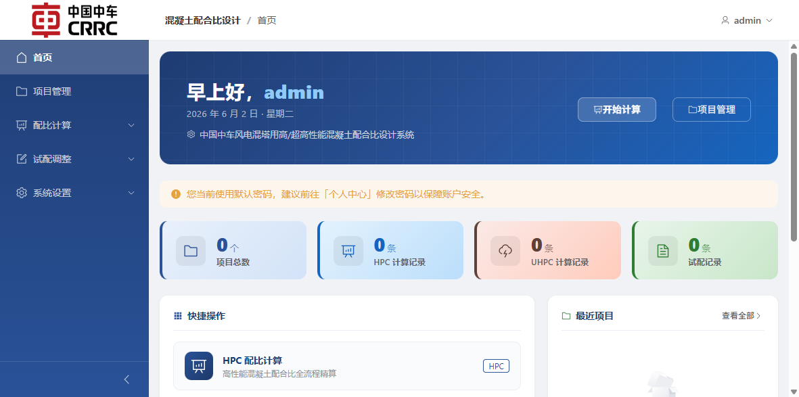

首页主要功能：

1. 通过“开始计算”快速进入 HPC 计算
2. 通过快捷卡片进入 HPC、UHPC、试配调整、项目管理等模块
3. 查看项目总数、HPC 记录数、UHPC 记录数等统计信息
4. 查看最近项目和最近配合记录

建议使用方式：

1. 新用户先进入“项目管理”新建项目
2. 老用户可直接从首页进入已有业务模块

---

## 5. 项目管理

### 5.1 新建项目

项目是组织配比记录的基础对象。点击“项目管理”页右上角“新建项目”，填写项目编号、项目名称和项目要求后完成创建。

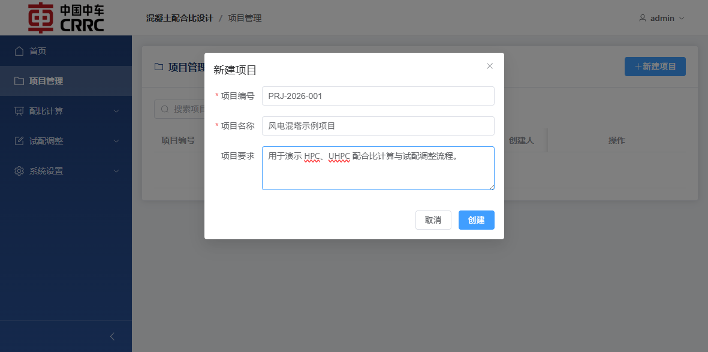

字段说明：

1. 项目编号：建议使用统一编码规范，例如 `PRJ-2026-001`
2. 项目名称：建议填写工程或方案名称
3. 项目要求：用于记录强度等级、耐久性、试验目标等要求

### 5.2 项目列表

项目创建后，会显示在项目管理列表中。可在这里搜索、进入详情或删除项目。

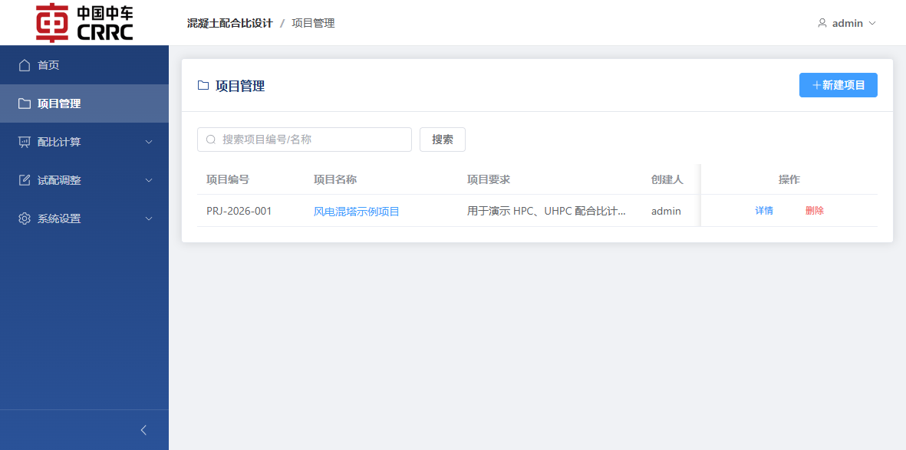

支持操作：

1. 搜索项目编号或项目名称
2. 查看项目详情
3. 删除项目

注意：删除项目不会删除其下的配比记录关联数据展示逻辑以外的其他页面素材，但实际业务上仍建议谨慎操作。

### 5.3 项目详情与项目内记录

进入项目详情后，可查看项目信息，并在该项目下新建 HPC/UHPC 配比。项目详情页同时汇总当前项目关联的配比记录。

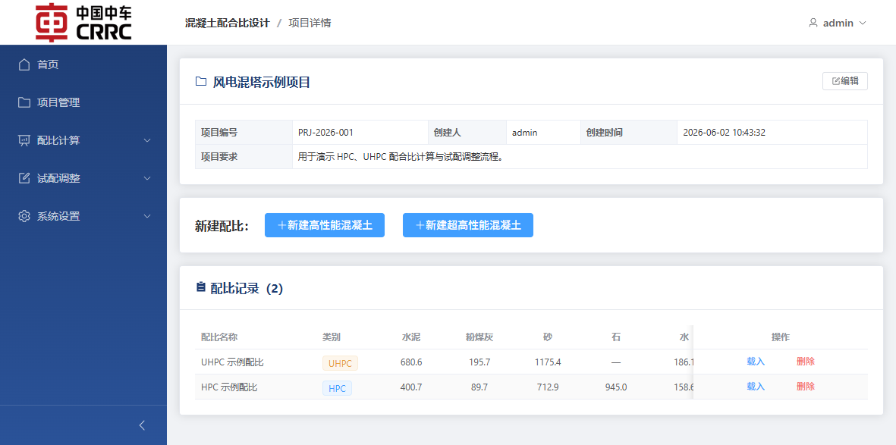

推荐操作顺序：

1. 先建立项目
2. 再在项目详情页中创建 HPC 或 UHPC 配比
3. 后续通过“载入”按钮复用历史配比

---

## 6. HPC 配合比计算

HPC 页面采用分步式流程，共 5 个页签：

1. 水胶比
2. 砂率选取
3. 骨料用量
4. 胶凝材料
5. 水和外加剂

### 6.1 水胶比

输入强度等级和胶凝材料 28d 强度后，系统会自动计算配制强度和水胶比。也可以上传试验数据文件进行回归系数拟合。

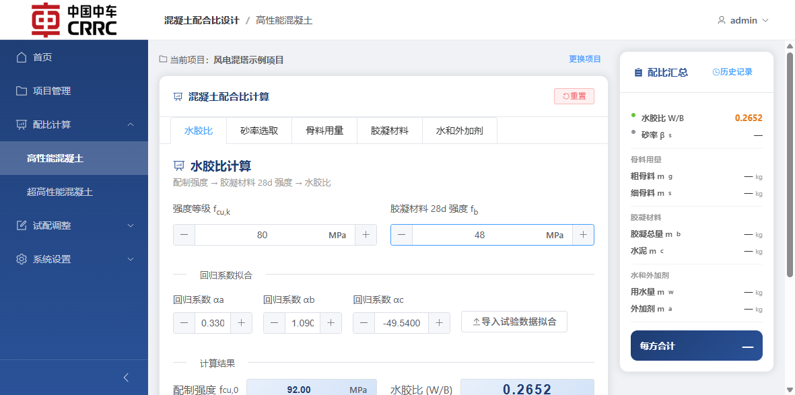

操作步骤：

1. 输入强度等级 `fcu,k`
2. 输入胶凝材料 28d 强度 `fb`
3. 如需拟合，上传试验 CSV/Excel 文件
4. 查看系统自动计算的 `fcu,0` 与 `W/B`
5. 点击“下一步”

### 6.2 砂率选取

系统提供参考表，通过点击强度等级行与粒径列，可获得交叉高亮的推荐范围。输入砂率后自动确认并传递到骨料计算页。

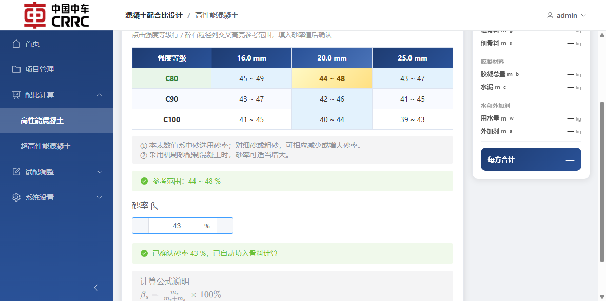

操作步骤：

1. 根据强度等级和骨料粒径查看参考范围
2. 输入目标砂率
3. 系统自动确认后进入下一步

### 6.3 骨料用量

骨料页根据已确认的砂率、粗骨料绝对体积和粗细骨料密度计算粗骨料、细骨料用量。

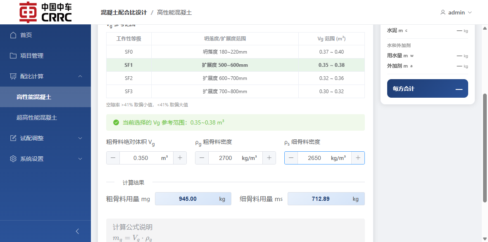

操作步骤：

1. 参考表格选择合适的 `Vg` 区间
2. 输入粗骨料绝对体积 `Vg`
3. 输入粗骨料密度 `ρg`
4. 输入细骨料密度 `ρs`
5. 查看系统自动计算的 `mg` 与 `ms`

### 6.4 胶凝材料、水和外加剂、保存记录

后续页签会在已计算结果基础上继续推导胶凝材料密度、各组分用量、用水量、外加剂用量以及总量。最终可直接保存为配比记录。

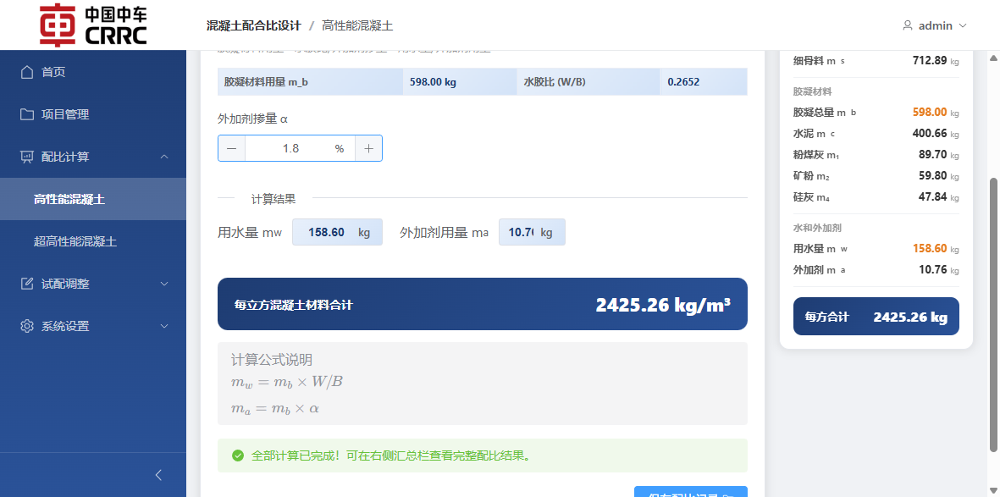

保存时需要输入配比名称。

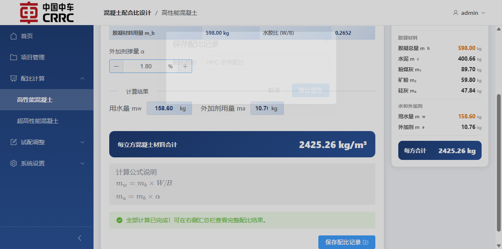

建议填写方式：

1. 粉煤灰、矿粉、硅灰掺量按照质量分数输入
2. 水泥与掺合料密度按试验材料实测值填写
3. 外加剂掺量填写百分比
4. 保存时使用有辨识度的名称，例如“C80 主塔筒 HPC 方案 A”

---

## 7. UHPC 配合比计算

UHPC 页面采用 4 个页签：

1. 水胶比
2. 砂胶比
3. 钢纤维用量
4. 胶凝材料比例

### 7.1 水胶比页

可直接点击推荐强度等级行，系统会带入推荐 `W/B`，并在空值情况下自动补入外加剂掺量默认值。

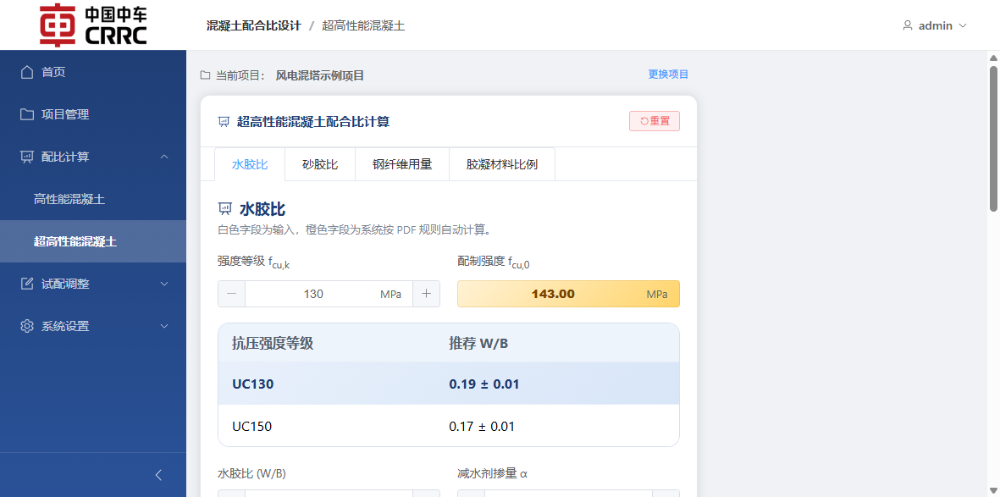

操作步骤：

1. 选择或输入强度等级
2. 参考推荐 `W/B` 区间选择具体数值
3. 输入外加剂掺量
4. 点击“下一步”

### 7.2 胶凝材料比例与保存

在最后一页输入粒径参数、微粉参数和材料密度后，系统自动计算：

1. 胶凝材料体积比例
2. 初始质量比例与修正质量比例
3. 每方材料用量与总量

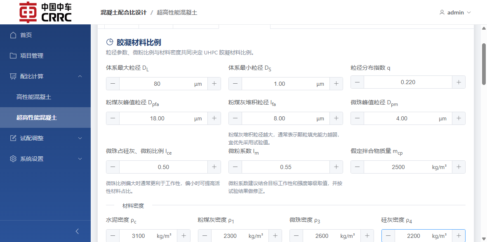

保存时同样需要填写记录名称。

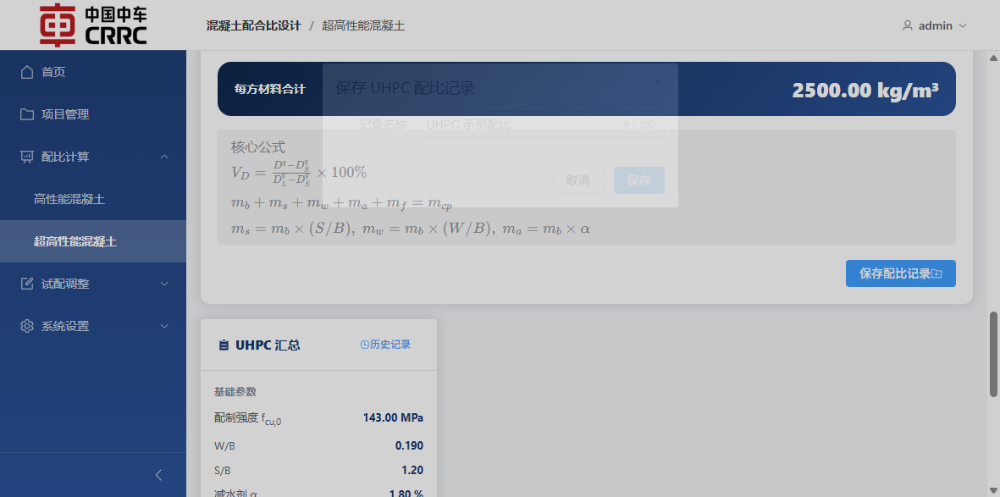

建议操作：

1. 若无试验值，可先按页面占位值录入，得到初始方案
2. 若已有材料试验数据，应优先录入实测粒径与密度
3. 保存后可在项目详情页或全部记录页重新载入

---

## 8. HPC 试配调整

高性能试配页是建立在已完成的 HPC 主配比基础上的扩展流程，包含 3 个实验阶段：

1. 工作性实验
2. 强度实验
3. 配合比校正与确认

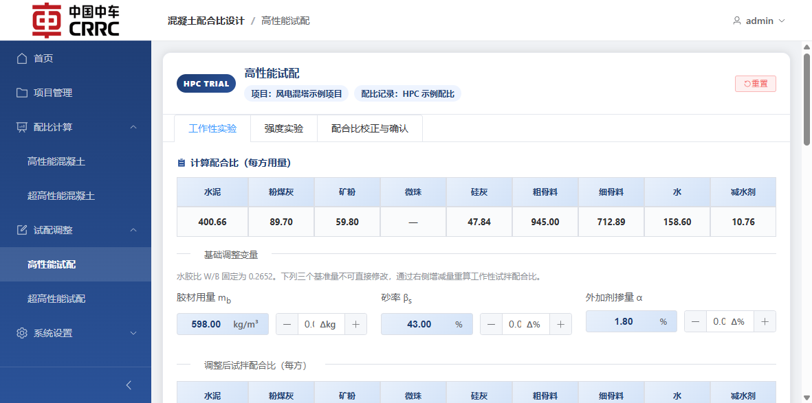

### 8.1 工作性实验

用户可在当前基准配比基础上调整：

1. 胶材用量增减量
2. 砂率增减量
3. 外加剂掺量增减量

系统会自动重算试拌配合比、试拌用量与汇总信息。

### 8.2 强度实验

进入强度实验页后，可录入不同调整组的强度结果，用于形成回归分析和推荐参数。

### 8.3 配合比校正与确认

最后一页用于表观密度校正和实验室配合比确认，完成后可将试配快照保存到原有 HPC 记录中。

使用建议：

1. 先保存主配比，再进入试配页
2. 试配页用于实验优化，不建议替代主配比设计页
3. 试配记录会附着在对应 HPC 配比记录下

---

## 9. UHPC 试配调整

超高性能混凝土试配调整包含 3 个实验阶段：

1. 工作性实验
2. 强度实验
3. 配合比校正与确定

### 9.1 工作性实验

用户可针对计算得出的 UHPC 主配比调整：

1. 砂胶比 (S/B)
2. 外加剂掺量 α (%)

调整后系统会自动重新生成满足新参数并考虑对应体积计算条件的试拌配合比。

### 9.2 强度实验

在试拌配合比基础上通过等质量替代策略，生成 “+Δ 纯配比”及“-Δ 残配比”(或者不同的水胶比试验组，或进行硅灰掺量的增减)。在页签中录入试验测得的实际强度后，系统会进行二次回归分析生成推荐配合方案。

### 9.3 配合比校正与确定

最终进入表观密度校正环节：

1. 选择调整配合比基准：支持采用试拌基准、推荐水胶比基准或推荐硅灰用量基准
2. 填入拌合物表观密度实测值
3. 系统自动计算校正系数，生成最终的 UHPC 实验室配合比

调整确认无误后点击“保存配比记录”，相关的试配快照将依附在原 UHPC 主记录中供查询和对比。

---

## 10. 全部记录管理

“全部记录”页面会统一展示全部项目下的 HPC/UHPC 配比记录，并支持搜索、筛选和重新载入。

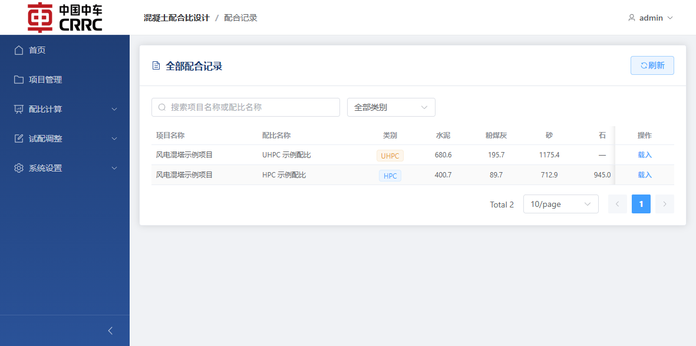

支持操作：

1. 按项目名称或配比名称搜索
2. 按类别筛选 HPC / UHPC
3. 点击“载入”回到对应计算页继续查看或修改

适用场景：

1. 快速查找历史方案
2. 跨项目对比不同类别配比
3. 重用已有参数作为新方案基础

---

## 11. 个人中心

个人中心用于维护当前登录用户的邮箱、手机号以及登录密码。

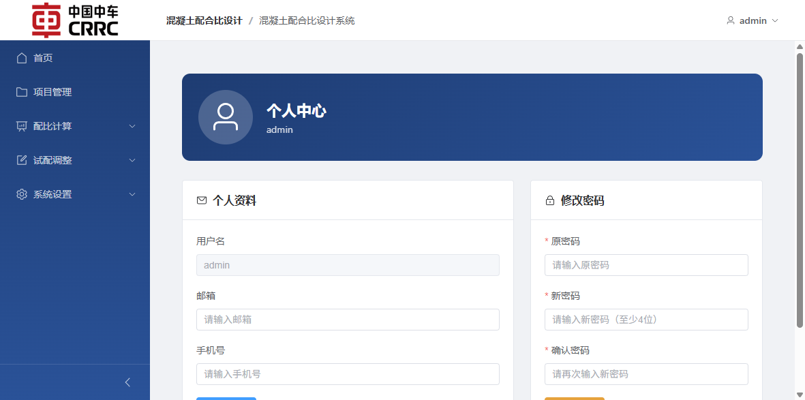

建议：

1. 首次登录后优先修改默认密码
2. 将邮箱和手机号维护完整，便于后续账号管理

---

## 12. 系统设置与用户管理

该页面仅管理员可见，用于创建用户、重置密码和删除普通用户。

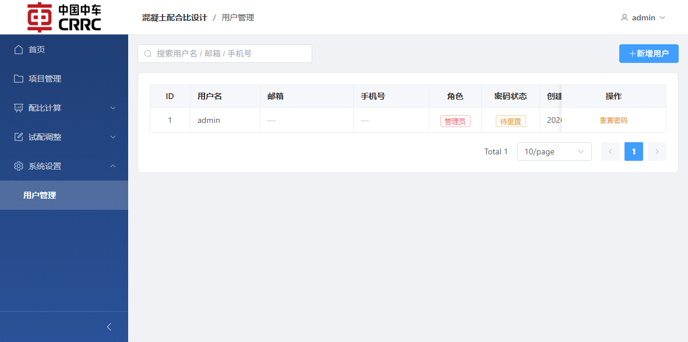

管理员可执行的操作：

1. 新增用户
2. 重置用户密码
3. 删除普通用户

管理规则说明：

1. 新用户默认密码为 `123456`
2. 新用户首次登录后应修改密码
3. 管理员账号本身不可按普通用户方式删除

---

## 13. 推荐使用流程

对于日常业务，建议采用以下操作顺序：

1. 登录系统
2. 在“项目管理”中建立项目
3. 进入项目详情页新建 HPC 或 UHPC 配比
4. 完成主配比计算并保存记录
5. 如需进一步优化 HPC 方案，再进入“高性能试配”页面
6. 在“全部记录”中统一查询和复用历史配比
7. 在“个人中心”维护密码与个人资料
8. 管理员在“系统设置”中维护用户账号

---

## 14. 当前版本注意事项

1. 所有业务页面都依赖登录态，未登录会自动跳转到登录页
2. 项目是记录归档的核心入口，建议始终先建项目再做配比
3. HPC 与 UHPC 配比记录都保存在统一记录体系中，但配比数据结构会根据类别自动区分
4. HPC / UHPC 试配记录依附于各自的主配比记录保存

---

## 15. 文档结论

从当前代码实现来看，本系统已经具备可投入日常使用的主干业务流程能力：

1. 项目管理完整
2. HPC 配比计算完整
3. UHPC 配比计算完整
4. HPC 试配调整与二次回归预测完整
5. UHPC 试配调整与配合比校正完整
6. 记录管理、个人资料维护、管理员用户管理均处于可用状态

下一阶段可考虑进一步完善：

1. 更完善的图表可视化数据分析支持
2. 试配结果和配合比计算书的 PDF / Excel 原生导出能力
3. 历史记录间的横向对比汇总能力
